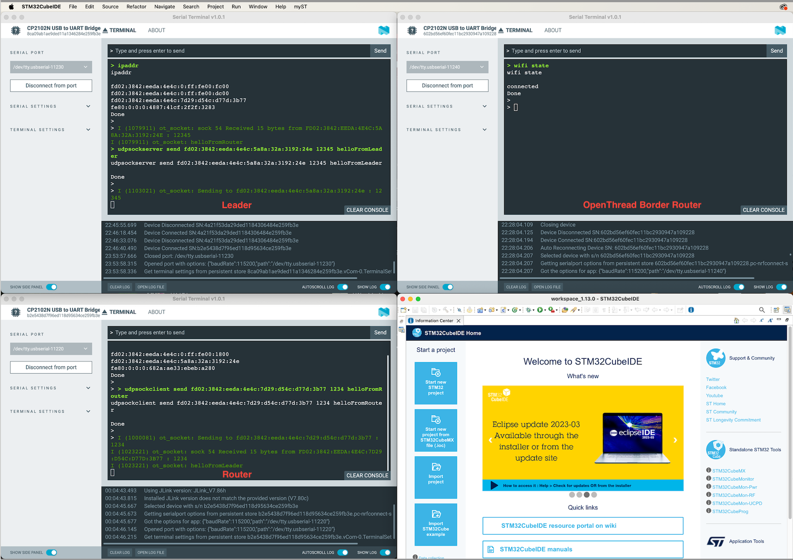

## Kompatybilność i Konfiguracja

### Kompatybilność

#### Border Router jest kompatybilny z następującymi płytkami:
- ESP32 | ESP32-C2 | ESP32-C3 | ESP32-C6 | ESP32-S2 | ESP32-S3

#### Radio Co-Processor jest kompatybilny z następującymi płytkami:
- ESP32-C5 | ESP32-C6 | ESP32-H2

#### Command Line jest kompatybilny z następującymi płytkami:
- ESP32-C5 | ESP32-C6 | ESP32-H2

### Budowanie Projektu

1. Dla każdego kontrolera budujemy odpowiedni projekt (ot_br/ot_rcp/ot_cli):
    ```sh
    idf.py set-target <ESP32>
    idf.py menuconfig
    idf.py -p <PORT> build flash monitor
    ```

### Łączenie Border Routera z Radio Co-Processorem:

2. Border Router łączymy z naszym RCP:
    | Border Router | RCP |
    |---------------|-----|
    | GND           | G   |
    | GPIO4         | TX  |
    | GPIO5         | RX  |

### Konfiguracja Wi-Fi

3. Przy Border Routerze musimy ustawić połączenie z Wi-Fi (można też ustawić automatyczne łączenie do sieci przy starcie lub ręcznie w `menuconfig`). Aby to zrobić, używamy komendy:
    ```sh
    wifi connect -s <SSID> -p <PASSWORD>
    ```

   Jeśli chcesz ustawić statyczny adres IP zamiast korzystać z DHCP, możesz użyć komendy:
    ```sh
    wifi set_ip -i <STATIC_IP> -g <GATEWAY_IP> -n <NETMASK>
    ```

   Jeśli wszystko pójdzie pomyślnie, OpenThread pokaże, że prefiksy ULA i lokalny prefiks na linii zostały ustawione i zostanie zwrócony komunikat „wifi stat is connected successfully”.

### Konfiguracja Command Line

4. Dla CLI, który ma być liderem:
    ```sh
    factoryreset
    dataset init new
    dataset commit active
    ifconfig up
    thread start
    ```

   Następnie możemy sprawdzić status urządzenia, który powinien zwrócić lidera:
    ```sh
    state
    ```

   Pobieramy dataset:
    ```sh
    dataset active -x
    ```

   I kopiujemy zwróconą wartość.

   **Na drugim urządzeniu CLI**:
   - Wykonujemy `factory reset`.
   - Ustawiamy dataset zwrócony z pierwszego urządzenia:
     ```sh
     dataset set active <DATASET>
     ```

   - Aktywujemy interfejs sieciowy i rozpoczynamy stos Thread:
     ```sh
     ifconfig up
     thread start
     ```

   Aby upewnić się, że wszystko poszło pomyślnie, uruchamiamy komendę `state`. Powinna zwrócić `router` bądź `child`.


Przydatna jest także komenda neighbor list, która zwraca nam informacje o sąsiadach. Dwa CLI powinny widzieć siebie nawzajem.

Następnie podglądamy sobie adres IP na obu CLI komendą:
     ```
ipaddr
     ```
     
### Komunikacja UDP pomiędzy CLI:
Na pierwszym cli otwieramy połączenie oraz bindujemy wybrany przez nas port:

```sh
udpsockserver open
udpsockserver bind <PORT>
```
     
Na drugim urządzeniu:
```sh
udpsockclient open <PORT>
```

I wysyłamy przykładową wiadomość na odpowiedni adres IP oraz port:
```sh
udpsockserver send <IP_ADDR> <PORT> hello
```

oraz z clienta:
```sh
udpsockclient send <IP_ADDR> <PORT> hello
```

### Komunikacja TCP pomiędzy CLI:
Na pierwszym cli tworzymy serwer oraz bindujemy wybrany przez nas port:

```sh
tcpsockserver open
tcpsockserver bind :: <PORT>
```
  
Następnie na drugim CLI:
```sh
tcpsockclient open
tcpsockclient connect <IP_ADDR> <PORT>
```

Aby wysłać wiadomość jako serwer:
```sh
tcpsockserver send hello
```

Aby wysłać wiadomość jako serwer:
```sh
tcpsockclient send hello
```


Poniżej screenshot z udanej komunikacji pomiędzy Leaderem, a Routerem:



